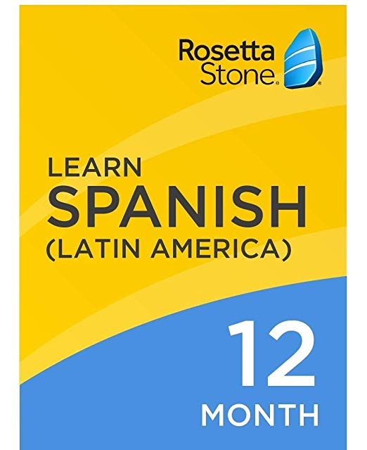

I, on the other hand, think that if you can only implement one software engineering technique to improve quality, it should be coding standards. Indeed, I believe some coding standards can actually help you learn a programming language. Do you agree?

I believe that the coding standard is the best standard. Having a coding standard does justice not just for yourself, but for others. Why? Let me tell five awesome things about coding standards.

First, it forces you to write nice code as opposed to normal code. Think of it like your car. No one likes a dirty car. You want it sparkling clean. 

Second, it's easier to collaborate on as a team. If you were working with other programmers on the same project, you will find that you will keep sharing and adding things to it. It's far more better if everyone on the on the team is on the same page and doing the same things. Plus your teammates will love you for it later.

Third, what hurts you now makes you stronger. The famous line from Kelly Clarkson's famous song, "Stronger", is very much true. If having a coding standard is a struggle for you, then don't give up. If you keep practicing, you might become a high class programmer one day.

After your first week of using ESLint with IntelliJ, what are your impressions? Are you finding that getting the green checkmark is painful, or useful, or both, or something else entirely?

