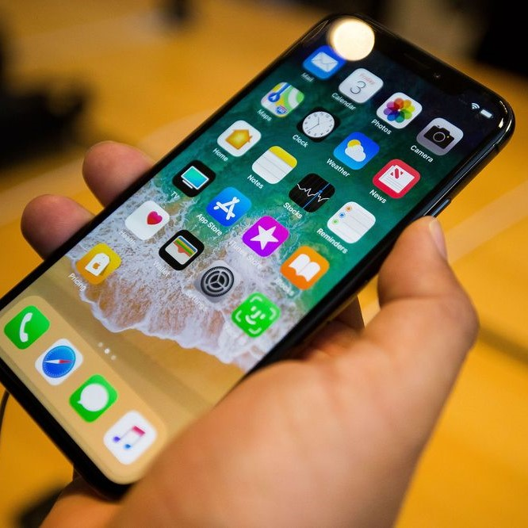

## Technology is Evolving

About 15 years ago, I remember as a kid getting my very first phone. It was a gray Nokia flip phone equipped with an antenna on the top. The only function it could do well was call a friend. Nothing else.

It is now 2019 and the phone I have now is an Apple iPhone X. Unlike my first phone it has so so many features. These include a touch screen, text messaging function, a voice recorder, a camera, and many more. Its call function has also improved significantly. The point is that technology is changing. As we grew up it has also grown more innovative.

## Software Engineering For the Future

Software engineering opens a big door for me. Instead of watching the innovation of technology, I become the innovator. I get to control the way technology and discover new things. I am also able to grow as a person and carve an exciting future. This is literally what makes software engineering very exciting to me. 

With software engineering, I expect a lot of great things. I hope to bring innovation into many lives. I wish to solve the problems of the majority.  I look forward to the people I meet and the experiences I will have. Most of all, I look forward to innovating the future and making it exciting.
