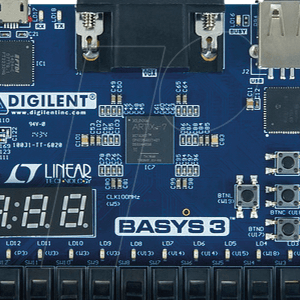

Basys3 is an FPGA for entry level users and is meant be programmed with Xilinx Vivado Suite. To program it one must have a decent knowledge of verilog and hardware knowledge. 

In this project, our tean of 3 designed a simple version of the game, Pong, onto a screen using a Basys3 board and an HDMI input. For the one who don't know what Pong is, this link below shows a demonstration of what it is and an exact similarity to what we did.

Pong Game: <https://www.youtube.com/watch?v=06W-Jvm5-5o>

Since this project was mostly logic and coding, there wasn't really a specific role we all played in this project. We spent all the time trying to code the project, finding the bugs, and running the game together. Through it all, we spent the most time fixing the bugs then actually ran it.

In this experience, we learned some incredible things. We learned about time and effort it takes to get to the end result. We also learned how to distinguish and differentiate the different signals, ports, and other things that came with challenge. Finally, the most important thing we learned is that patience and teamwork is what makes the game work.
