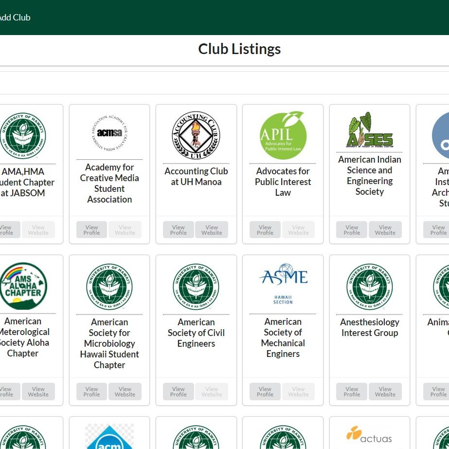

## Description

Looking for a club? Ready to find the one for you? Like E-Harmony, we find the perfect match for you. With the Manoa Club Hunt, we use a scientific algorithm to find clubs who are looking for people like you. Get started today by registering for a free user profile on Manoa Club Hunt. So what are you waiting for? Use Manoa Club Hunt today.

## Contributions

I was responsible for the following:
  * Landing Page Design
  * Landing Page Image Carousel
  * Footer Design
  * Club Database and JSON file
  * Adding Image Fields to Club Database
  * Adding Description Fields to Club Database
  * Galaxy Application Deployment
  * File Clean Up

## Tools Gained

From this project, me and my team learned many things. Things I learned include the following:
  * Agile Project Management
  * Obtaining JSON File Data
  * Database Management
  * Image Carousel
  * Galaxy Application Deployment
  * Cleaning Up Files
 
## Project Home Page
For Home page, click [here](https://manoa-club-hunt.github.io/).

## Source Code
For source code, click [here](https://github.com/manoa-club-hunt/manoa-club-hunt).
